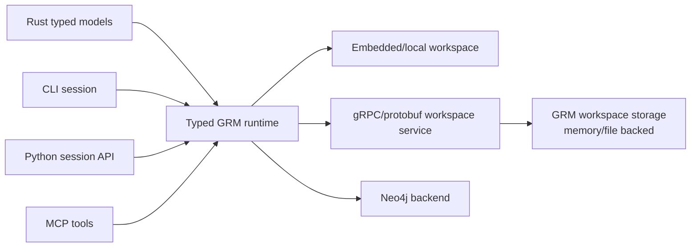
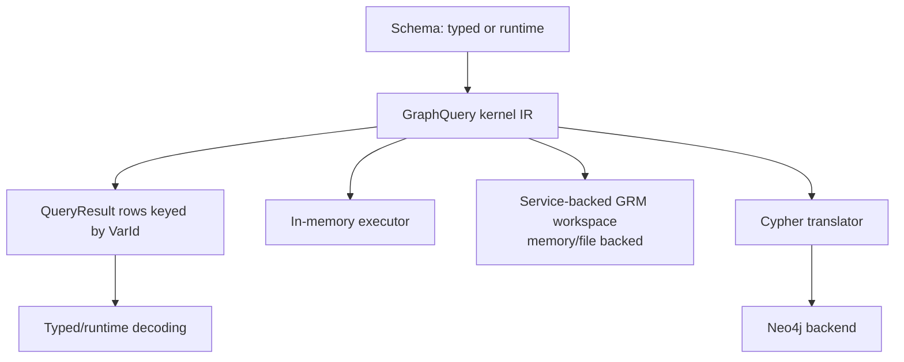

# grm-rs

`grm-rs` is a local-first graph toolkit for Rust projects, CLI workflows, Python
automation, and agent-facing MCP tools.

It is for project knowledge that is naturally graph-shaped: files contain
symbols, users author posts, jobs depend on tasks, agents remember facts,
documents cite sources, and relationships carry their own data. GRM gives that
shape a typed Rust API, an interactive session CLI, a runtime schema layer, and a
backend contract that can run locally in memory or against live graph backends
such as Neo4j.

The project is still evolving, but the direction is clear: model graph-shaped
work once, then use it from the surfaces that make sense for the job.



## Why Use GRM?

Use GRM when you want graph semantics without making every workflow start inside
a database browser or a string-based query language.

GRM is useful when you want to:

- define typed Rust node and relationship models
- keep backend-assigned IDs explicit and strongly typed
- build graph data interactively from a CLI
- save, load, import, and export local graph workspaces
- traverse related data with a graph-shaped query surface
- inspect query behavior with `session.explain` and `session.profile`
- expose graph workflows to Python scripts or MCP agents
- keep a path open to real graph backends such as Neo4j

It sits somewhere between an OGM, a local graph workspace, a typed query kernel,
and an agent-friendly memory substrate.

## What It Looks Like

In Rust, a graph model is ordinary typed data plus derive macros:

```rust
use grm_rs::{NodeModel, RelModel, typed_id};
use serde::{Deserialize, Serialize};

typed_id!(UserId);
typed_id!(PostId);
typed_id!(AuthoredId);

#[derive(Debug, Clone, Serialize, Deserialize, NodeModel)]
pub struct User {
    #[grm(id)]
    #[serde(skip)]
    pub id: UserId,
    pub name: String,
}

#[derive(Debug, Clone, Serialize, Deserialize, NodeModel)]
pub struct Post {
    #[grm(id)]
    #[serde(skip)]
    pub id: PostId,
    pub title: String,
}

#[derive(Debug, Clone, Serialize, Deserialize, RelModel)]
#[grm(from = "User", to = "Post", ty = "AUTHORED")]
pub struct Authored {
    #[grm(id)]
    #[serde(skip)]
    pub id: AuthoredId,
    pub year: u64,
}
```

In the CLI, the same shape can be explored at runtime:

```text
model.define User userId name:string:required
model.define Post postId title:string:required
link.define AUTHORED User Post authoredId year:int:required

node.create User name="Alice"
node.create Post title="Graph Notes"
edge.create AUTHORED from=1 to=2 year=2026

node.find User name=Alice via=out:AUTHORED:Post
session.indexes
session.explain node.find User name=Alice via=out:AUTHORED:Post
session.profile node.find User name=Alice via=out:AUTHORED:Post
```

The CLI can save and reload a workspace, export interchange JSON, and run
scripts before dropping into an interactive session.

```bash
cargo run --bin grm -- session
cargo run --bin grm -- session --script examples/session_setup.grm
```

## Main Surfaces

### Rust Library

The Rust API is the typed core of the project. It provides:

- `NodeModel` and `RelModel` derive macros
- typed ID newtypes
- repository helpers
- explicit transactions through `GraphClient`
- a backend-neutral `GraphQuery` kernel IR
- typed query results keyed by kernel variables
- local workspace autocommit through `Workspace::execute_runtime`

The in-memory backend is useful for tests and local workflows. Neo4j support is
available through a backend adapter and shared behavior tests.

### CLI Session

The CLI is a runtime graph workspace. It can:

- define node and relationship models
- create, update, delete, find, and traverse graph data
- render results as human text, table, JSONL, or graph-shaped output
- explain and profile current query shapes
- save/load local sessions
- import/export interchange JSON
- use autocommit and compaction for local persistence workflows

Local autocommit uses the shared runtime durability path used by the CLI,
Python package, MCP server, and Rust `Workspace::execute_runtime` path. The
scoped guarantee is intentionally boring: after a successful autocommit write
returns, the write is present in either the append log or a checkpoint on a
single local filesystem, assuming one writer owns the session/store. Direct
low-level workspace state mutations are not claimed to autocommit.
Interactive CLI `session.autocommit --json|--bin <path>` checkpoints the current
session immediately and may replace an existing target. Use `session.load` or
startup `--load` to resume existing data, and keep separate backups for
important local files.

For future direction, see [docs/cli-roadmap.md](docs/cli-roadmap.md). Detailed
command walkthroughs are moving toward tutorial docs rather than living in the
README.

### Python

The Python package lives in [`grm-python`](grm-python). It currently targets the
runtime session surface with Python-friendly dict/list inputs.

```bash
cd grm-python
maturin develop
```

```python
from grm_rs import Session

session = Session()
session.model_create(
    "User",
    "userId",
    [{"name": "name", "type": "string", "required": True}],
)
session.node_create("User", {"name": "Alice"})
```

See [docs/python-quickstart.md](docs/python-quickstart.md).

### MCP And Agent Workflows

The MCP surface is aimed at agents that need to create, inspect, and update graph
knowledge. Current work favors structured operations over asking agents to write
CLI command strings.

See [docs/mcp-batch-graph-patch-requirements.md](docs/mcp-batch-graph-patch-requirements.md).

### Service-Backed Workspace Storage

A Docker-hostable local gRPC workspace shell can expose GRM workspace storage
operations over the generated protobuf API. This is a backend/storage mode for
GRM-owned memory/file backed workspaces and adapter integration, not a separate
user-facing surface, production daemon, Neo4j-backed service, or hosted
durability claim.

Pull and run the published insecure local service:

```bash
docker pull lauriebart/grm:latest
docker run --rm --name grm \
  -p 127.0.0.1:50051:50051 \
  -v grm-workspaces:/workspaces \
  lauriebart/grm:latest
```

Or build the current checkout with Docker Compose:

```bash
docker compose up --build
```

The service listens on `localhost:50051` and supports the workspace-scoped RPCs:

- `CreateWorkspace`
- `OpenWorkspace`
- `ExecuteWorkspace`
- `CloseWorkspace`

Schema, node, edge, simple find, and batch operations should be sent through
`ExecuteWorkspace`. Direct non-workspace RPC families in the proto are still
explicitly unsupported by the local shell.
Checked service-backed clients use binary local autocommit workspace files by
default; JSON remains an explicit debug/interchange-friendly option. The current
durability target is single-writer local filesystem behavior, documented in
[docs/local-durability-target.md](docs/local-durability-target.md).

Try the checked Rust client example:

```bash
cargo run -p grm-service-api --example local_workspace_client -- \
  http://127.0.0.1:50051 demo-workspace
```

Or route the regular CLI session through the service-backed workspace path:

```bash
GRM_BACKEND=grpc \
GRM_SERVICE_ENDPOINT=http://127.0.0.1:50051 \
GRM_WORKSPACE_REF=demo-workspace \
GRM_SERVICE_WORKSPACE_MODE=create \
cargo run --bin grm -- session
```

To seed a small movie graph through the same typed workspace path and continue
interactively:

```bash
GRM_BACKEND=grpc \
GRM_SERVICE_ENDPOINT=http://127.0.0.1:50051 \
GRM_WORKSPACE_REF=movies-demo \
GRM_SERVICE_WORKSPACE_MODE=create \
cargo run --bin grm -- session --script examples/service_movies.grm
```

`GRM_SERVICE_WORKSPACE_FORMAT` defaults to binary; JSON is an explicit opt-in.
Create mode rejects an existing workspace ref; use
`GRM_SERVICE_WORKSPACE_MODE=open` to reopen an existing service-managed
workspace without altering it.

See [docs/grpc-docker-service.md](docs/grpc-docker-service.md),
[docs/grpc-quickstart.md](docs/grpc-quickstart.md), and
[docs/local-durability-target.md](docs/local-durability-target.md).

## Architecture

GRM is organized around a small backend contract. The same high-level behavior
should work against the indexed in-memory backend and against live graph
backends where capabilities allow it.



The current in-memory backend maintains system indexes for node ids, node
labels, exact node-property lookup, relationship ids, relationship types, and
incoming/outgoing adjacency. These indexes are backend-maintained derived
acceleration structures, not durable source-of-truth data. `session.indexes`
exposes the catalog, and structured explain/profile output includes per-step
access metadata and in-memory profile metrics so callers can distinguish
index-backed seeks, adjacency expansion, scans, and residual filters.
User-defined indexes are future work; the current planner is simple rather than
cost-based.

Backend behavior is covered by shared tests for the in-memory backend and an
ignored/env-gated Neo4j suite.

```bash
cargo test --test backend_behavior
```

To run the live Neo4j behavior test:

```bash
NEO4J_URI=host.docker.internal:7687 \
NEO4J_USER=neo4j \
NEO4J_PASSWORD=... \
cargo test --test backend_behavior neo4j_backend_satisfies_shared_behavior_when_env_is_set -- --ignored --nocapture
```

## Learn By Workflow

Tutorials are the home for detailed workflow walkthroughs across CLI, Python,
MCP, and future Rust/Neo4j paths. Start with the
[tutorials index](docs/tutorials/README.md).

Available tutorials include:

- [CLI sessions](docs/tutorials/cli-session.md)
- [Python sessions](docs/tutorials/python-session.md)
- [MCP workflows](docs/tutorials/mcp-workflow.md)
- [Rust service workspaces](docs/tutorials/rust-service-workspace.md)
- [gRPC service](docs/grpc-docker-service.md)

Additional reference docs:

- [Python quickstart](docs/python-quickstart.md)
- [Query language design](docs/query-language-design.md)
- [Import/export](docs/import-export.md)
- [Query and persistence optimization](docs/perf/query-persistence-optimization.md)
- [MCP batch and graph patch requirements](docs/mcp-batch-graph-patch-requirements.md)

Planned tutorials:

- Rust embedded typed models: derives, repositories, transactions, traversal
- Neo4j: running the same behavior against a live backend

## Status

GRM is usable for local experimentation, typed Rust graph workflows, runtime CLI
sessions, Python session experiments, and MCP-oriented integration work.

The most mature areas are:

- typed Rust models and IDs
- in-memory backend behavior
- runtime CLI schema/data workflows
- traversal queries and graph-shaped CLI output
- backend behavior tests
- first-phase query explain/profile

The most active areas are:

- Python and MCP parity
- local persistence durability
- session-core/runtime-schema cleanup
- stronger backend support

For the current forward plan, see [docs/cli-roadmap.md](docs/cli-roadmap.md).

## Development

Run tests:

```bash
cargo test
```

Run the CLI:

```bash
cargo run --bin grm -- session
```

Run Criterion benchmarks:

```bash
cargo bench --bench grm_vs_sqlite
```

Some benchmark and Neo4j workflows are opt-in; see the relevant docs and test
files for environment variables.

License

Copyright 2026 Laurie Ibbs

Licensed under the Apache License, Version 2.0. See LICENSE for details.

Project Identity

SOML, Structured Operational Memory Layer, GRM, and GRM-RS are project identifiers associated with this repository and related software.

The Apache License grants rights to use, modify, and distribute the source code. It does not grant rights to use project names, logos, branding, or other identifying marks in a way that implies official endorsement, sponsorship, affiliation, or authorship.

For additional information, see NOTICE.md and TRADEMARKS.md.

Project website: https://soml.io
