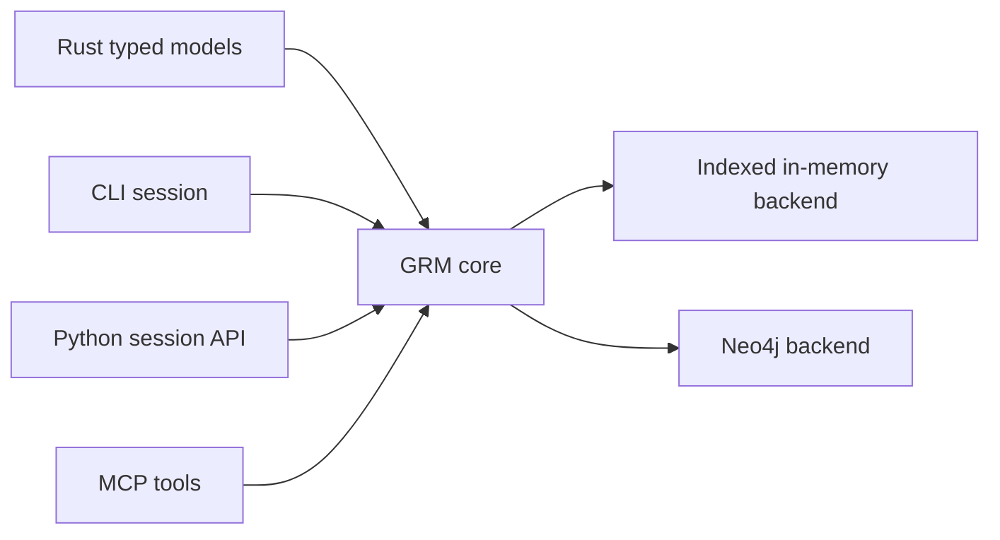
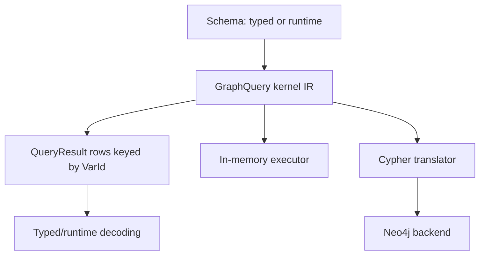

# grm-rs

`grm-rs` is a local-first graph toolkit for Rust projects, CLI workflows, Python
automation, and agent-facing MCP tools.

It is for project knowledge that is naturally graph-shaped: files contain
symbols, users author posts, jobs depend on tasks, agents remember facts,
documents cite sources, and relationships carry their own data. GRM gives that
shape a typed Rust API, an interactive session CLI, a runtime schema layer, and a
backend contract that can run locally in memory or against live graph backends
such as Neo4j.

The project is still evolving, but the direction is clear: model graph-shaped
work once, then use it from the surfaces that make sense for the job.



## Why Use GRM?

Use GRM when you want graph semantics without making every workflow start inside
a database browser or a string-based query language.

GRM is useful when you want to:

- define typed Rust node and relationship models
- keep backend-assigned IDs explicit and strongly typed
- build graph data interactively from a CLI
- save, load, import, and export local graph workspaces
- traverse related data with a graph-shaped query surface
- inspect query behavior with `session.explain` and `session.profile`
- expose graph workflows to Python scripts or MCP agents
- keep a path open to real graph backends such as Neo4j

It sits somewhere between an OGM, a local graph workspace, a typed query kernel,
and an agent-friendly memory substrate.

## What It Looks Like

In Rust, a graph model is ordinary typed data plus derive macros:

```rust
use grm_rs::{NodeModel, RelModel, typed_id};
use serde::{Deserialize, Serialize};

typed_id!(UserId);
typed_id!(PostId);
typed_id!(AuthoredId);

#[derive(Debug, Clone, Serialize, Deserialize, NodeModel)]
pub struct User {
    #[grm(id)]
    #[serde(skip)]
    pub id: UserId,
    pub name: String,
}

#[derive(Debug, Clone, Serialize, Deserialize, NodeModel)]
pub struct Post {
    #[grm(id)]
    #[serde(skip)]
    pub id: PostId,
    pub title: String,
}

#[derive(Debug, Clone, Serialize, Deserialize, RelModel)]
#[grm(from = "User", to = "Post", ty = "AUTHORED")]
pub struct Authored {
    #[grm(id)]
    #[serde(skip)]
    pub id: AuthoredId,
    pub year: u64,
}
```

In the CLI, the same shape can be explored at runtime:

```text
model.define User userId name:string:required
model.define Post postId title:string:required
link.define Authored User Post authoredId year:int:required

node.create User name="Alice"
node.create Post title="Graph Notes"
edge.create Authored from=1 to=2 year=2026

node.find User name=Alice via=out:Authored:Post
session.explain node.find User name=Alice via=out:Authored:Post
session.profile node.find User name=Alice via=out:Authored:Post
```

The CLI can save and reload a workspace, export interchange JSON, and run
scripts before dropping into an interactive session.

```bash
cargo run --bin grm -- session
cargo run --bin grm -- session --script examples/session_setup.grm
```

## Main Surfaces

### Rust Library

The Rust API is the typed core of the project. It provides:

- `NodeModel` and `RelModel` derive macros
- typed ID newtypes
- repository helpers
- explicit transactions through `GraphClient`
- a backend-neutral `GraphQuery` kernel IR
- typed query results keyed by kernel variables

The in-memory backend is useful for tests and local workflows. Neo4j support is
available through a backend adapter and shared behavior tests.

### CLI Session

The CLI is a runtime graph workspace. It can:

- define node and relationship models
- create, update, delete, find, and traverse graph data
- render results as human text, table, JSONL, or graph-shaped output
- explain and profile current query shapes
- save/load local sessions
- import/export interchange JSON
- use autocommit and compaction for local persistence workflows

For future direction, see [docs/cli-roadmap.md](docs/cli-roadmap.md). Detailed
command walkthroughs are moving toward tutorial docs rather than living in the
README.

### Python

The Python package lives in [`grm-python`](grm-python). It currently targets the
runtime session surface with Python-friendly dict/list inputs.

```bash
cd grm-python
maturin develop
```

```python
from grm_rs import Session

session = Session()
session.model_create(
    "User",
    "userId",
    [{"name": "name", "type": "string", "required": True}],
)
session.node_create("User", {"name": "Alice"})
```

See [docs/python-quickstart.md](docs/python-quickstart.md).

### MCP And Agent Workflows

The MCP surface is aimed at agents that need to create, inspect, and update graph
knowledge. Current work favors structured operations over asking agents to write
CLI command strings.

See [docs/mcp-batch-graph-patch-requirements.md](docs/mcp-batch-graph-patch-requirements.md).

## Architecture

GRM is organized around a small backend contract. The same high-level behavior
should work against the indexed in-memory backend and against live graph
backends where capabilities allow it.



The current in-memory backend maintains indexes for labels, properties,
relationship types, and adjacency. Transaction overlay reads preserve
read-your-writes behavior without forcing whole-store materialization on the
important query paths.

Backend behavior is covered by shared tests for the in-memory backend and an
ignored/env-gated Neo4j suite.

```bash
cargo test --test backend_behavior
```

To run the live Neo4j behavior test:

```bash
NEO4J_URI=host.docker.internal:7687 \
NEO4J_USER=neo4j \
NEO4J_PASSWORD=... \
cargo test --test backend_behavior neo4j_backend_satisfies_shared_behavior_when_env_is_set -- --ignored --nocapture
```

## Learn By Workflow

Tutorials are the planned home for detailed walkthroughs across CLI, Rust,
Python, and MCP. Until the tutorial set is filled out, start with:

- [Python quickstart](docs/python-quickstart.md)
- [Query language design](docs/query-language-design.md)
- [Import/export](docs/import-export.md)
- [Query and persistence optimization](docs/query-persistence-optimization.md)
- [MCP batch and graph patch requirements](docs/mcp-batch-graph-patch-requirements.md)

The intended tutorial package will cover:

- CLI sessions: define, create, traverse, explain/profile, save/load
- Rust typed models: derives, repositories, transactions, traversal
- Python sessions: runtime schema and graph workflows
- MCP workflows: batch/patch-oriented agent graph updates
- Neo4j: running the same behavior against a live backend

## Status

GRM is usable for local experimentation, typed Rust graph workflows, runtime CLI
sessions, Python session experiments, and MCP-oriented integration work.

The most mature areas are:

- typed Rust models and IDs
- in-memory backend behavior
- runtime CLI schema/data workflows
- traversal queries and graph-shaped CLI output
- backend behavior tests
- first-phase query explain/profile

The most active areas are:

- Python and MCP parity
- local persistence durability
- session-core/runtime-schema cleanup
- stronger backend support

For the current forward plan, see [docs/cli-roadmap.md](docs/cli-roadmap.md).

## Development

Run tests:

```bash
cargo test
```

Run the CLI:

```bash
cargo run --bin grm -- session
```

Run Criterion benchmarks:

```bash
cargo bench --bench grm_vs_sqlite
```

Some benchmark and Neo4j workflows are opt-in; see the relevant docs and test
files for environment variables.
