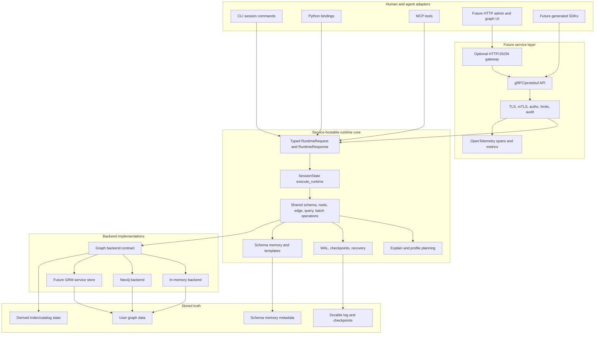

# Aspirational Service Architecture

Status: Draft

Date: 2026-05-22

This document describes the target architecture GRM is moving toward as it
separates embedded runtime behavior from a future service backend. It is
aspirational: it should guide roadmap and review decisions, but it is not a
claim that every component exists today.

See also:

- [Service Boundary Design Spike](../service-boundary-design.md)
- [ADR 0001: Separate Graph Data From Schema Memory](../adr/0001-graph-data-and-schema-memory.md)
- [Testing Policy](../testing-policy.md)

## Product Shape

GRM should become:

> typed, secure, explainable graph memory for applications and agents

The sellable surface is not a database language. The future service boundary
should receive structured typed operations for schema, graph CRUD, query,
batch, explain/profile, and durability/admin work. CLI commands, Python helper
methods, MCP tools, and future browser consoles can remain ergonomic adapters,
but they should translate into typed requests before crossing the trusted
runtime or service boundary.

## Architecture Diagram

## Current Direction

GRM is currently converging on a service-hostable runtime core:

- `RuntimeRequest` and related request enums describe typed operation families.
- `SessionState::execute_runtime` provides an early typed runtime dispatcher for
  schema, node, edge, and simple find/query paths.
- CLI, Python, and MCP are moving toward adapter roles that parse friendly
  inputs and call shared runtime behavior.
- Shared mutation helpers such as `apply_node_create`,
  `apply_node_update`, `apply_edge_create`, and related delete/update helpers
  remain the durability-aware paths for write adapters.
- Explain/profile and index catalog work make query behavior visible enough to
  demo and eventually sell.
- WAL/checkpoint work has established local durability foundations, but claims
  must remain grounded in tested single-writer local filesystem behavior.
- Neo4j MCP mode is useful for dogfooding graph memory and visualization, but
  it is not full in-memory backend parity.

## Target Boundaries

### Adapter Boundary

Adapters own user ergonomics:

- CLI may parse human-readable command text.
- Python may expose convenient methods and dictionaries.
- MCP may expose tool-shaped JSON for agents.
- A future HTTP UI may accept browser-friendly forms or command text.

Adapters should not define canonical behavior. They should convert user input
into typed request objects as early as practical, then rely on shared runtime
semantics.

### Runtime Boundary

The runtime core owns embedded behavior:

- schema definition and validation
- node and edge create/update/delete/find
- traversal/query request execution
- batch graph patch application
- explain/profile planning and metrics
- durability hooks and durable operation grouping
- schema memory loading, persistence, and validation

This layer should be hostable by CLI, Python, MCP, tests, and a future daemon.
It should avoid depending on CLI parser concepts or process-local UI behavior.

### Service Boundary

The future service boundary should be gRPC/protobuf with typed messages.
Production service mode should default to encrypted transport and
certificate-based authentication. Authorization, request limits, audit records,
and telemetry should be designed before marketplace packaging.

Textual command strings may appear in human tools, but they should not become
the service contract.

### Backend Boundary

Backends should implement graph storage behavior behind a common contract while
being honest about capability differences. In-memory and Neo4j may not expose
identical physical plans, index usage, transaction behavior, or durability
properties. Explain/profile and backend status should make those differences
visible rather than masking them.

### Storage Boundary

GRM should preserve the distinction between:

- graph data: the user's domain nodes, edges, properties, labels, and relation
  names
- schema memory: the intended model, field, relationship, index, query, and
  recall affordances that orient agents and humans

Schema memory may eventually live inside a backend as GRM metadata, but it
should remain conceptually distinct from user graph data.

## What Progress Looks Like

Good progress moves behavior toward one shared typed core without widening
product claims prematurely.

Acceptable near-term progress:

- adapters route more read behavior through `execute_runtime`
- write paths converge only when durable operation metadata remains explicit
- structured request and response types become easier to map to protobuf
- tests prove behavior through runtime, MCP, Python, CLI, or backend public
  surfaces as appropriate
- explain/profile exposes access paths and costs without pretending all
  backends use the same physical planner
- Neo4j orientation improves through backend status, store summary, and schema
  introspection without claiming full parity

Progress to avoid:

- adding patch, upsert, merge, bulk delete, or multi-match delete semantics
  under the banner of cleanup
- moving adapter-specific filter syntax into the canonical service contract
- routing write adapters through value-only dispatcher responses while silently
  dropping durability metadata
- adding a service transport before the typed runtime boundary is stable enough
  to map cleanly
- overstating crash recovery, multi-writer, clustering, or hosted durability
  guarantees

## Near-Term Sequence

1. Finish adapter routing through typed runtime paths where safe.
2. Decide the durable outcome shape for dispatcher-backed writes.
3. Add the service API proto crate or design skeleton.
4. Add mapping tests between protobuf messages and runtime request/response
   types.
5. Add a minimal daemon only after transport, security posture, durability
   claims, and authorization boundaries are clear enough to review.

The daemon is not the next architectural proof. The next proof is that all
surfaces can share the same typed runtime semantics without depending on a
textual language or duplicating behavior.

## Future Graph Representation

This document should also be represented in GRM project memory as queryable
architecture nodes: components, boundaries, constraints, decisions,
dependencies, and work slices. The Markdown file is the human artifact. The
graph is the agent orientation layer.

A future architecture skill should query that graph before planning or review
work and answer:

- which boundary the change touches
- which constraints apply
- which roadmap item the change advances
- whether the change is cleanup, new product behavior, or service design
- what tests prove progress at the right ownership boundary

