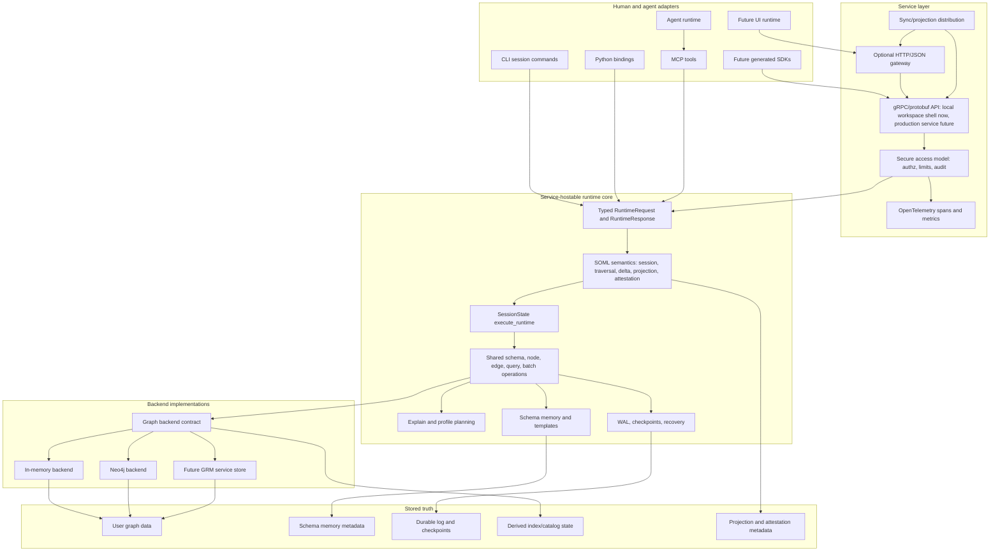

# Aspirational Service Architecture

Status: Draft

Date: 2026-05-22

This document describes the target architecture GRM is moving toward as it
separates embedded runtime behavior from a future service backend and adopts the
Structured Operational Memory Layer framing from ADR 0004. It is aspirational:
it should guide roadmap and review decisions, but it is not a claim that every
component exists today.

See also:

- [Service Boundary Design Spike](../service-boundary-design.md)
- [ADR 0001: Separate Graph Data From Schema Memory](../adr/0001-graph-data-and-schema-memory.md)
- [ADR 0004: Frame GRM As A Structured Operational Memory Layer](../adr/0004-structured-operational-memory-layer.md)
- [ADR 0005: Use Graph Workspaces And Durable Envelopes](../adr/0005-graph-workspace-and-durable-envelope.md)
- [Testing Policy](../testing-policy.md)

## Product Shape

GRM should become a Structured Operational Memory Layer:

> typed, secure, explainable operational memory for applications and agents

The sellable surface is not a database language. The future service boundary
should receive structured typed operations for sessions, traversal/state
resolution, durable deltas, projections, attestation/provenance, explain/profile,
and durability/admin work. Graph CRUD remains an implementation subset beneath
operational memory semantics. CLI commands, Python helper methods, MCP tools,
and future browser consoles can remain ergonomic adapters, but they should
translate into typed requests before crossing the trusted runtime or service
boundary.

ADR 0004 adds this concept vocabulary to the architecture:

| Concept | Architecture meaning |
| --- | --- |
| Session | Operational memory context |
| Traversal | Explainable state resolution |
| Delta | Durable operational mutation |
| Projection | Contextual memory surface |
| Attestation | Verifiable operational proof |
| Runtime | Executable memory substrate |

These concepts should guide naming in new docs, graph memory, service API
design, UI/sync planning, and agent-facing examples. They should not trigger a
mechanical rename of existing Rust modules, tests, or adapter APIs before the
semantics exist.

## Current Architecture Against SOML

GRM is partially aligned with the SOML target:

| Boundary | Current state | SOML gap |
| --- | --- | --- |
| Adapter | CLI, Python, and MCP exist. MCP already accepts structured tool JSON, and Python/MCP routes some read paths through structured runtime requests. Adapter filter maps still preserve legacy ergonomics before conversion. | Keep adapter-specific syntax at the edge. Do not let CLI/filter-map conveniences become the canonical operational memory contract. |
| Runtime | `RuntimeRequest`, `RuntimeResponse`, and `SessionState::execute_runtime` exist for schema, node, edge, query, batch, explain/profile, and admin families. Schema, node, edge, simple find/query, and batch requests execute through shared runtime behavior and preserve durable operation metadata where writes occur. Explain/profile, traversal query, and admin remain explicitly unsupported in the runtime dispatcher where they are not implemented. | Runtime concepts are still graph CRUD/query shaped. Session, delta, projection, and attestation are not first-class runtime request families yet. |
| Service | `grm-service-api` exists as a split-ready protobuf contract crate. It now compiles generated protobuf DTOs, converts generated schema/node/edge/query/batch shapes into service/runtime requests, proves generated schema and batch requests can execute through `SessionState::execute_runtime`, and exposes a minimal local gRPC workspace shell over create/open/execute/close workspace RPCs. | The proto still mirrors current graph/runtime operation families. The gRPC shell is a demo transport proof, not a daemon, security boundary, hosted durability claim, or full direct-RPC implementation. It does not yet model SOML concepts such as session context, projections, attestations, or provenance evidence. |
| Backend | In-memory and Neo4j backends sit behind common contracts with visible capability differences. Neo4j MCP mode supports schema-aware CRUD and simple find, but not full traversal/query/import/export/explain/profile parity. | Backend capability reporting should evolve toward operational memory capabilities, not just storage capability lists. |
| Storage | User graph data, schema memory metadata, durable logs/checkpoints, and derived index/catalog state are conceptually separate. | Durable state should increasingly be described and tested as operational deltas. Projection and attestation storage models are still design work. |

The important conclusion is that GRM has a typed runtime spine, not a completed
SOML implementation. The architecture should adopt SOML as the target product
model while keeping product claims grounded in implemented and tested behavior.

## Architecture Diagram

## Current Direction

GRM is currently converging on a service-hostable runtime core:

- `RuntimeRequest` and related request enums describe typed operation families.
- `SessionState::execute_runtime` provides an early typed runtime dispatcher for
  schema, node, edge, simple find/query paths, and batch graph patches.
- CLI, Python, and MCP are moving toward adapter roles that parse friendly
  inputs and call shared runtime behavior.
- `SessionState::execute_runtime` returns durable operation metadata for
  schema, node, edge, and batch mutations while read paths return an empty
  durable operation list.
- `grm-service-api` now includes generated protobuf DTOs and conversion paths
  that drive existing runtime behavior in-process. This proves a
  service-hostable runtime contract.
- A minimal local gRPC workspace shell now delegates create/open/execute/close
  workspace RPCs to `InProcessWorkspaceService` over managed handles. It proves
  the contract can be hosted over gRPC for demo and integration work, while
  direct schema/node/edge/query/admin RPCs remain explicit unsupported surfaces.
- Explain/profile and index catalog work make query behavior visible enough to
  demo and eventually sell.
- WAL/checkpoint work has established local durability foundations for a future
  durable workspace envelope, but claims must remain grounded in tested
  single-writer local filesystem behavior.
- Neo4j MCP mode is useful for dogfooding graph memory and visualization, but
  it is not full in-memory backend parity.
- `grm-service-api` is a split-ready protobuf contract crate, not a daemon or
  private production service implementation.
- SOML/SAM vocabulary is now accepted product architecture, but session,
  projection, attestation, and provenance semantics remain aspirational unless
  backed by code and tests.

## Aspirational Goals After ADR 0004

ADR 0004 shifts the target from "service-hostable graph runtime" to
"service-hostable operational memory runtime." The practical goals are:

1. Treat `RuntimeRequest`/`RuntimeResponse` as the implementation spine, but
   evaluate new request families by whether they express operational memory
   concepts rather than only graph CRUD.
2. Introduce session context deliberately: runtime/service requests should have
   a path to carry operational context, limits, identity/audit metadata, and
   capability expectations without smuggling those concerns through adapter
   globals.
3. Treat successful writes as durable deltas. Existing durable operation
   metadata is the starting point, but future WAL/protobuf design should make
   operational mutation grouping, replay, and recovery evidence explicit.
4. Make traversal and explain/profile the trust model for state resolution.
   Plans, access paths, backend capability notes, row counts, and timing should
   support "why this memory state was returned," not just query debugging.
5. Model projections as contextual memory surfaces for UI, sync, and agents.
   A projection is not merely a formatted query result; it is a bounded view
   with provenance, refresh/distribution expectations, and explainable source
   semantics.
6. Defer attestation until there is a minimal credible proof model. Do not
   market attestation/provenance as delivered before the runtime can emit and
   tests can verify concrete evidence.
7. Keep storage subordinate to runtime semantics. In-memory, Neo4j, future GRM
   service storage, indexes, and acceleration structures are implementation
   choices behind operational memory behavior.

## Target Boundaries

### Adapter Boundary

Adapters own user ergonomics:

- CLI may parse human-readable command text.
- Python may expose convenient methods and dictionaries.
- MCP may expose tool-shaped JSON for agents.
- A future HTTP UI may accept browser-friendly forms or command text.

Adapters should not define canonical behavior. They should convert user input
into typed request objects as early as practical, then rely on shared runtime
semantics.

### Runtime Boundary

The runtime core owns embedded behavior:

- schema definition and validation
- node and edge create/update/delete/find
- traversal/query request execution
- batch graph patch application
- explain/profile planning and metrics
- durability hooks and durable operation grouping
- schema memory loading, persistence, and validation

This layer should be hostable by CLI, Python, MCP, tests, and a future daemon.
It should avoid depending on CLI parser concepts or process-local UI behavior.

### Service Boundary

The future service boundary should be gRPC/protobuf with typed messages.
Production service mode should default to encrypted transport and
certificate-based authentication. Authorization, request limits, audit records,
and telemetry should be designed before marketplace packaging.

Textual command strings may appear in human tools, but they should not become
the service contract.

Under the SOML framing, the service boundary should also reserve design space
for:

- session context and backend capability negotiation
- durable delta outcomes and recovery evidence
- projection requests and projection distribution
- provenance and attestation evidence
- secure structured access policy around operational memory concepts, not only
  graph models and CRUD verbs

### Backend Boundary

Backends should implement graph storage behavior behind a common contract while
being honest about capability differences. In-memory and Neo4j may not expose
identical physical plans, index usage, transaction behavior, or durability
properties. Explain/profile and backend status should make those differences
visible rather than masking them.

### Storage Boundary

GRM should preserve the distinction between:

- graph data: the user's domain nodes, edges, properties, labels, and relation
  names
- schema memory: the intended model, field, relationship, index, query, and
  recall affordances that orient agents and humans

Schema memory may eventually live inside a backend as GRM metadata, but it
should remain conceptually distinct from user graph data.

ADR 0004 adds two future storage concerns:

- durable operational deltas: replayable mutation records that explain state
  transitions
- projection/attestation metadata: derived or recorded evidence used to explain
  contextual memory surfaces and prove execution claims

Like indexes and acceleration structures, projection caches should be treated as
derived unless a future design explicitly makes them durable source-of-truth
records.

## What Progress Looks Like

Good progress moves behavior toward one shared typed core without widening
product claims prematurely.

Acceptable near-term progress:

- adapters route more read behavior through `execute_runtime`
- write paths converge only when durable operation metadata remains explicit
- generated protobuf request DTOs map to typed runtime requests without adding a
  daemon, transport, security policy, or new mutation semantics
- service API objects gain SOML-oriented shape only where runtime semantics are
  clear enough to implement and test
- tests prove behavior through runtime, MCP, Python, CLI, or backend public
  surfaces as appropriate
- explain/profile exposes access paths and costs without pretending all
  backends use the same physical planner
- Neo4j orientation improves through backend status, store summary, and schema
  introspection without claiming full parity

Progress to avoid:

- adding patch, upsert, merge, bulk delete, or multi-match delete semantics
  under the banner of cleanup
- moving adapter-specific filter syntax into the canonical service contract
- routing write adapters through value-only dispatcher responses while silently
  dropping durability metadata
- expanding the local gRPC transport proof into daemon lifecycle, auth,
  hosted durability, or direct service-only semantics before the typed runtime
  boundary is stable enough to map cleanly
- overstating crash recovery, multi-writer, clustering, or hosted durability
  guarantees
- renaming graph CRUD concepts to SOML terms without implementing the stronger
  session, delta, projection, provenance, or attestation semantics
- implying projection, sync, secure access, or attestation are delivered product
  capabilities before public surfaces and tests make those claims true

## Near-Term Sequence

1. Finish adapter routing through typed runtime paths where safe, and shrink
   adapter-owned backend execution logic when it can move behind runtime/backend
   boundaries.
2. Add a design note for the minimum SOML service additions: session context,
   delta outcome, projection request, and attestation evidence.
3. Tighten durability language and tests around operational deltas, replay, and
   recovery evidence before widening product claims.
4. Use the thin local gRPC workspace shell as a demo and integration proof while
   durability work catches up.
5. Add a minimal daemon only after production transport, security posture,
   durability claims, and authorization boundaries are clear enough to review.

The daemon is not the next architectural proof. The current proof is that the
typed workspace contract can be hosted locally over gRPC without depending on a
textual language or duplicating behavior. The next SOML proof is that those
typed semantics can carry durable workspace recovery behavior end to end without
renaming unsupported behavior into existence.

## Future Graph Representation

This document should also be represented in GRM project memory as queryable
architecture nodes: components, boundaries, constraints, decisions,
dependencies, and work slices. The Markdown file is the human artifact. The
graph is the agent orientation layer.

A future architecture skill should query that graph before planning or review
work and answer:

- which boundary the change touches
- which constraints apply
- which roadmap item the change advances
- whether the change is cleanup, new product behavior, or service design
- what tests prove progress at the right ownership boundary
