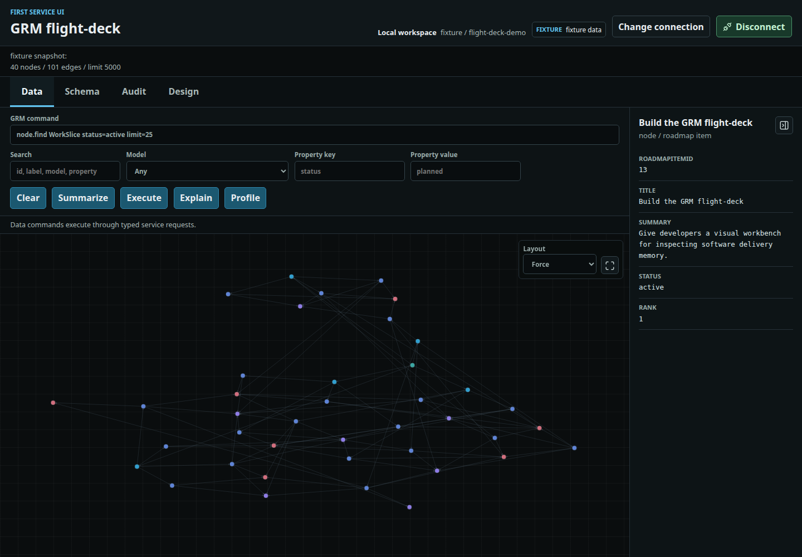
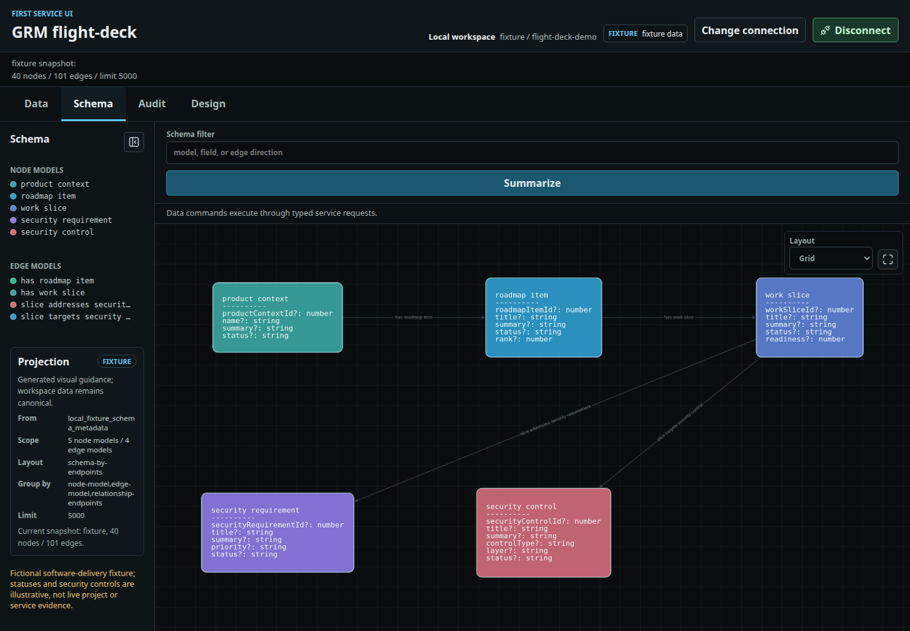
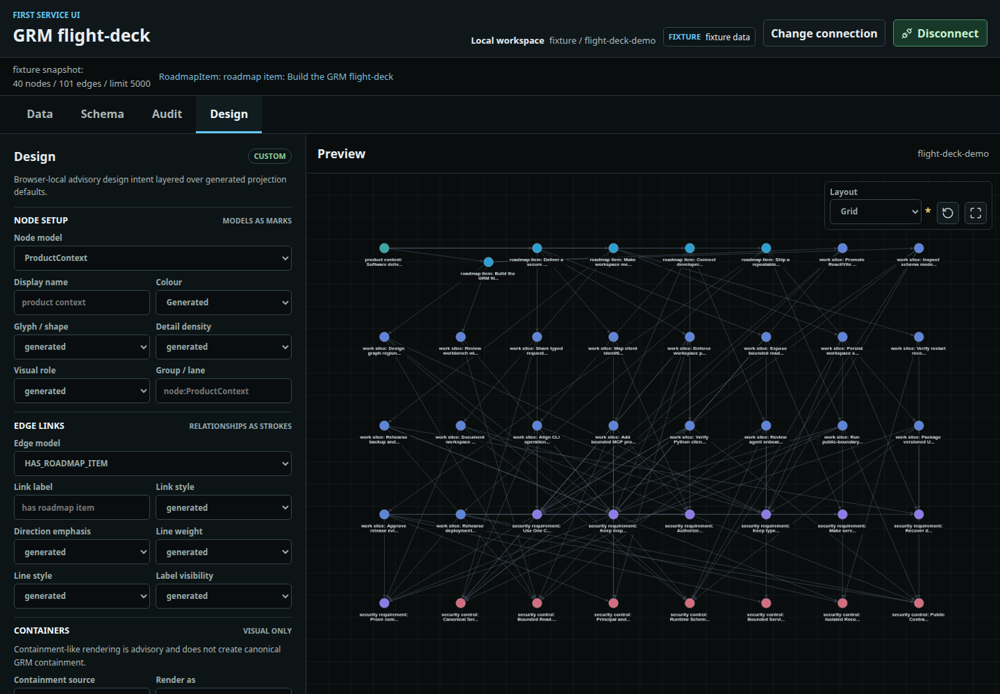
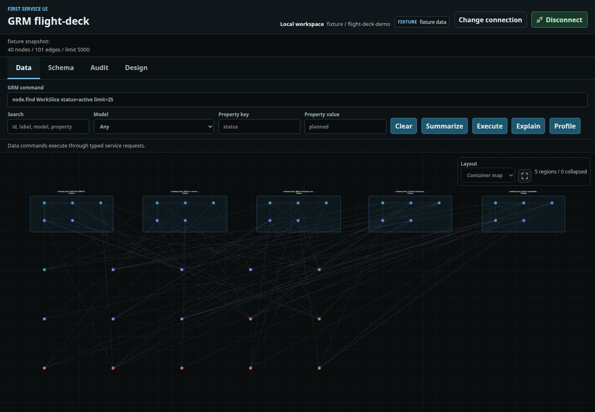
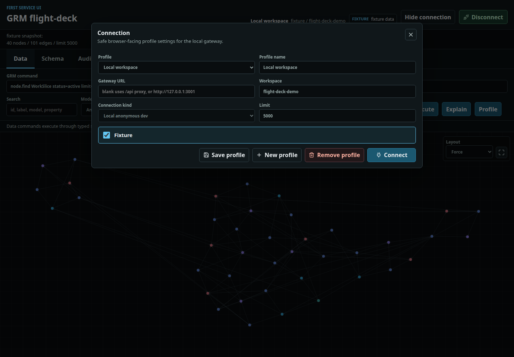
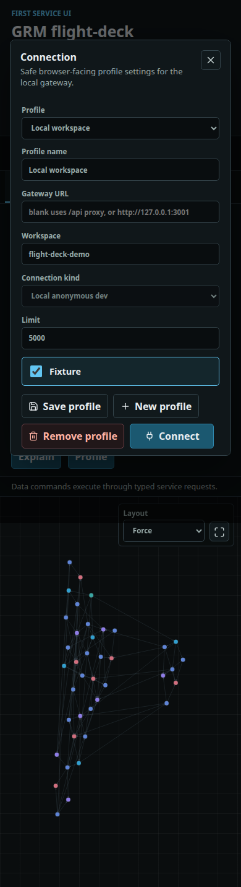

# Flight-Deck Review Gallery

Selected Playwright captures for the visual-workbench and container-map change.
Captured on 2026-10-07 using fictional software-delivery fixtures: 40 nodes,
101 edges, five node models, and four relationship models. These are normal
interactive states, not failure screenshots or live project-memory records.

## Data and Node Details

The Data workspace with a selected roadmap item, readable properties, and the
collapsible details panel.

Source: `tests/flightDeck.visual.spec.ts`, node/edge details regression at 1440px.

## Schema

The Schema workspace with model/field cards and a separately collapsible
catalogue. Schema defaults to the label-aware Grid layout.

Source: Data/Schema canvas-framing regression at 1440px.

## Design and Manual Placement

Dedicated Design controls and preview, with a Grid layout that has been moved
manually. The dropdown remains available; the asterisk and restore icon mark
the changed arrangement.

Source: real mouse-drag regression in Design.

## Relationship-Derived Containers

RoadmapItem -> WorkSlice relationships rendered as five expanded visual
regions. Other relationships remain visible. This is browser-local visual
grouping, not a change to canonical data; containers are flat, not nested.

Source: supplementary Playwright capture at 1440x1000 using the same fixtures
and normal Design controls (`HAS_WORK_SLICE`, region, expanded, Container/map).

## Connection Settings

Visible Fixture checkbox, profile actions, and responsive dialog layout.
Connection state is session-local; Disconnect retains the saved profile.

Source: profile-action regressions at 1440px and 390px.

## Verification

- `npm run test:e2e`: 40 passing Chromium browser tests.
- `npm test`: 28 passing unit tests.
- `npm run build`: successful production build.

Run these commands from `grm-flight-deck`. The full browser report is generated
under `playwright-report`; open it with `npx playwright show-report`. Passing
demo screenshots are saved under `test-results`. These selected copies are
kept here so the PR examples survive subsequent test runs.
