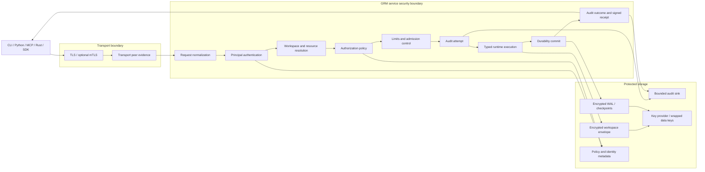

# GRM Security Design

Status: Proposed

Date: 2026-06-15

## Purpose

This document translates the [GRM Threat Model](threat-model.md) into a target
security architecture for embedded, local-service, and future hosted GRM
deployments.

It defines component responsibilities, enforcement order, security context,
policy boundaries, evidence, encryption, and staged implementation. It is a
design target, not a claim that all controls described here are implemented.

## Design Goals

GRM security should:

- preserve the confidentiality, integrity, and availability of operational
  memory;
- authenticate principals without trusting client-supplied actor labels;
- authorize typed operations against server-resolved workspace resources;
- apply request limits before expensive runtime or backend work;
- produce bounded, redacted evidence for allowed, denied, and failed requests;
- encrypt network traffic and durable workspace material where required;
- preserve runtime validation, transaction, delete, and durability invariants
  after authorization;
- give clients evidence that can detect rollback, omission, or equivocation by
  a compromised service; and
- keep every security claim tied to a deployment profile and tested public
  surface.

## Non-Goals

The initial design does not promise:

- protection from malicious code in the same embedded process;
- multi-writer, clustered, or Byzantine-consensus durability;
- complete confidentiality from a service process that must read plaintext;
- proof that original source data is truthful;
- production tenant isolation before identity, policy, and negative isolation
  tests exist;
- arbitrary end-to-end encrypted graph processing;
- a general policy language in the first implementation slice; or
- remote attestation, transparency witnesses, or Merkle execution proofs in the
  first security-core release.

## Architecture



The canonical secured service path remains the workspace-scoped typed
`ExecuteWorkspace` path. Direct RPC aliases and future gateways must enter the
same pipeline and must not create alternate authorization or audit behavior.

## Deployment Profiles

### Embedded Local

The application process is the security principal and trust boundary.

- Authentication and service authorization are not provided within the
  process.
- Runtime validation and durability safety remain active.
- Filesystem permissions and optional workspace encryption protect offline
  state.
- Code running with the same process or key access can read and modify memory.

This profile is appropriate for local tools and trusted applications, not
tenant isolation.

### Local Development Service

The service binds to loopback by default and may use an explicitly selected
insecure transport.

- Insecure operation must be visible in startup logs and service status.
- Anonymous-local compatibility may be allowed only by explicit configuration.
- Anonymous-local requests must not be described as authenticated.
- Workspace access remains constrained by server-managed handles and roots.

This profile must not be exposed beyond a trusted host.

### Secured Service

The secured profile requires:

- TLS with server identity and hostname validation;
- an application authentication mechanism;
- default-deny authorization policy;
- request and response limits;
- bounded security audit;
- protected key and credential loading;
- encryption at rest for configured workspace artifacts and backups; and
- negative tests for unauthenticated, unauthorized, cross-workspace, malformed,
  and over-limit requests.

mTLS may establish a transport peer and may contribute to application
authentication through an explicit certificate mapping. Possessing a trusted
client certificate does not otherwise imply workspace permission.

### Future Hosted Service

The hosted profile additionally requires:

- explicit tenant and workspace ownership;
- tenant-isolated policy, keys, audit, quotas, and lifecycle;
- production certificate, token, secret, and key rotation;
- administrative separation of duties;
- incident response and vulnerability handling;
- externally testable availability and recovery objectives; and
- evidence supporting every hosted durability and isolation claim.

## Security Context

Every accepted service request should be represented internally by a trusted
security context constructed by the service:

```text
SecurityContext
  request_id
  authenticated_principal
  authentication_method
  transport_peer
  asserted_actor
  delegated_actor
  workspace
  operation
  resource
  policy_version
  authorization_decision
  limits
  trace_context
```

The context should not be accepted as a client-authored protobuf object.
Client metadata may supply credentials, request IDs, actor assertions, or trace
context, but the service validates and converts those inputs into trusted
internal values.

An asserted actor remains informational until policy explicitly binds it to an
authenticated principal or valid delegation. Audit must preserve the
difference between principal, actor assertion, and transport peer.

## Enforcement Pipeline

The service processes every request in this order:

1. **Transport validation**: establish the encrypted channel and collect
   transport-peer evidence.
2. **Decode and normalize**: reject malformed protobufs, ambiguous operation
   variants, invalid identifiers, and unsupported operations.
3. **Authenticate**: resolve credentials to an immutable principal and
   authentication method.
4. **Resolve scope**: resolve workspace handles, workspace identity, operation
   family, target models, and protected resources on the server.
5. **Authorize**: evaluate principal, actor/delegation, action, resource,
   workspace, and policy version.
6. **Admit and limit**: apply message size, traversal, batch, result, profile,
   concurrency, deadline, rate, and storage-pressure limits.
7. **Record attempt**: emit a bounded audit event before execution for
   security-relevant allowed attempts and all denied requests.
8. **Execute**: call the typed runtime path. Runtime schema, transaction,
   delete, and durability checks still apply.
9. **Commit**: establish the durable outcome for mutations before reporting a
   durable success.
10. **Record outcome**: distinguish denial, validation failure, runtime failure,
    committed success, and response-delivery failure.
11. **Return evidence**: bind the response to the request and, where supported,
    include a durable receipt or state commitment.

Authentication, policy errors, unknown operations, and missing security
configuration fail closed in the secured and hosted profiles.

## Authentication

The first implementation should define one canonical principal type independent
of credential format:

```text
Principal
  issuer
  subject
  authentication_method
  attributes
```

Candidate authentication mechanisms are:

- mTLS certificate identity mapped through configured trust and mapping policy;
- signed bearer tokens with validated issuer, audience, expiry, and signature;
  and
- an explicit anonymous-local principal restricted to the local development
  profile.

Authentication providers should return either a validated principal or a
failure. They must not return permissions. Credential parsing, certificate
mapping, and token validation belong at the service boundary.

Credentials and private keys must never be written to normal logs, audit
details, error bodies, or tracing attributes.

## Authorization Model

Authorization evaluates:

```text
Decision = policy(principal, actor, action, resource, workspace, context)
```

The initial action taxonomy should distinguish:

- workspace create, open, execute, and close;
- schema inspect and define;
- node create, read, update, and delete;
- edge create, read, update, and delete;
- batch apply;
- traversal and query;
- explain and profile;
- checkpoint, backup, restore, and other durability administration; and
- identity, policy, key, and audit administration.

Resources should include workspace, model, edge/link model, operation family,
and administrative resource. IDs and property values should not become policy
dimensions until there is a concrete requirement and bounded evaluation model.

The first policy engine may be a small deterministic role/permission table. It
must still support:

- default deny;
- explicit policy version;
- deterministic decision reason;
- batch authorization over every contained operation;
- stricter administrative actions;
- no permission supplied by adapters or clients; and
- fail-closed behavior on policy load or evaluation failure.

## Workspace Isolation

Workspace identity is resolved by the service from an opaque reference or
managed handle. The client must never choose a server filesystem path.

The secured design binds:

- handles to a workspace identity;
- workspace access to the authenticated principal and policy;
- open handles to a service lifecycle and eventual lease/expiry policy; and
- encryption keys, audit records, limits, and future state commitments to the
  same stable workspace identity.

Cross-workspace denial tests are release-blocking for any multi-user or hosted
claim.

## Limits And Availability

Limits are policy evaluated before runtime execution where possible. The
secured profile should define finite defaults for:

- serialized request and response bytes;
- batch operation count;
- traversal depth and step count;
- result rows and page size;
- profile execution time and detail;
- request deadline;
- concurrent requests per principal and workspace;
- active workspace handles;
- audit queue and retention;
- WAL, checkpoint, and temporary storage pressure; and
- authentication failures and request rate.

Limit failures use stable error codes without exposing backend topology,
filesystem paths, credentials, graph values, or policy internals.

Cancellation should propagate into runtime and backend work where supported,
but cancellation must not turn a committed mutation into an ambiguous reported
failure without durable outcome evidence.

## Audit Design

Audit is a security record, not a debug log.

An audit event should contain:

- event and request identifiers;
- timestamp and service identity;
- authenticated principal and authentication method;
- separately labelled asserted or delegated actor;
- workspace identity;
- operation and protected resource classification;
- policy version, decision, and bounded reason code;
- request limit classification;
- runtime and durability outcome;
- response-delivery outcome when known; and
- previous and resulting state commitments when supported.

Audit should exclude graph property values, credentials, private paths, raw
tokens, private keys, and unbounded request bodies by default.

The audit sink contract must define backpressure, retention, failure behavior,
ordering expectations, redaction, and access policy. A process-local unbounded
vector is not an acceptable secured-profile audit sink.

## Encryption In Transit

Secured clients must:

- validate a configured trust root;
- validate the expected server name;
- reject expired or otherwise invalid certificates;
- avoid plaintext credential transmission; and
- support certificate and trust-root replacement without code changes.

Servers should use TLS by default when binding beyond loopback. mTLS is
recommended for controlled service-to-service deployments.

TLS protects the connection. It does not establish application authorization or
prove honest server execution.

## Encryption At Rest

The encryptable workspace set includes:

- workspace envelope or snapshots;
- WAL records and checkpoints;
- schema and catalog metadata;
- audit files when they contain protected metadata;
- backups and exports intended to retain confidentiality; and
- stored external-backend credentials.

The preferred design is envelope encryption:

1. Generate a random data-encryption key for a workspace or artifact class.
2. Encrypt data with an authenticated-encryption algorithm.
3. Wrap the data key with a key-encryption key held by an operating-system
   keystore, KMS, HSM, or explicitly configured local key provider.
4. Store algorithm, version, nonce, key identifier, and wrapped-key metadata
   with the ciphertext.
5. Authenticate stable workspace identity and format version as associated
   data.

Key material should be separated from encrypted workspace files and backups.
The design must specify creation, rotation, revocation, backup, recovery, and
destruction. Rotation should support rewrapping data keys without rewriting all
workspace data where practical.

Host disk encryption remains useful defense against lost media, but it is not
equivalent to GRM-managed artifact encryption. Neither protects plaintext from
a compromised process that can invoke the required key.

## Client-Verifiable Service Evidence

TLS authenticates the endpoint, not the correctness of its answers. GRM should
add verifiable evidence in stages.

### Stage 1: Request-Bound Durable Receipts

A mutation receipt should bind:

- protocol and receipt version;
- service and workspace identity;
- canonical request digest and request ID;
- authenticated principal or privacy-preserving principal reference;
- policy version and decision;
- previous and resulting workspace commitment;
- durable operation outcome and commit sequence;
- timestamp or logical time; and
- signing key identifier and signature.

The client verifies the signature, request digest, workspace, outcome, and
continuity with its last trusted commitment.

### Stage 2: Hash-Linked Workspace History

Each committed delta or checkpoint should commit to the previous state:

```text
commitment[n] = H(version || workspace || sequence ||
                  previous_commitment || delta_digest || metadata_digest)
```

Clients retaining a trusted commitment can then detect unexpected rollback,
history replacement, reordering, or a fork presented to the same client.

### Stage 3: Merkle And Read Proofs

A future workspace representation may provide Merkle roots and inclusion or
absence proofs for selected reads. This requires a deliberate authenticated
data structure and should not be bolted onto the current persistence format
without performance and semantics work.

### Stage 4: Independent Detection

Transparency logs, independent witnesses, replicas, or client gossip may detect
a service presenting different validly signed histories to different clients.
Remote attestation may additionally identify measured service software and
environment.

Signatures prove who signed a statement, not that its source data was true.
Hash continuity proves consistency from a trusted checkpoint, not honest
original input. Independent truth requires witnesses, trusted sources, quorum,
or external audit.

## Key And Trust Management

GRM should treat these as distinct key classes:

- TLS server and client private keys;
- token issuer verification keys;
- artifact key-encryption keys;
- workspace data-encryption keys;
- receipt-signing keys; and
- future attestation keys.

Keys must have explicit purpose, identifier, owner, storage provider, rotation
policy, revocation behavior, and audit treatment. A TLS key should not also sign
workspace receipts.

Configuration should refer to keys through paths or provider identifiers rather
than embedding secrets in command-line arguments. Startup should reject partial
or contradictory secured-profile configuration.

## Error And Observability Design

Public errors should use stable categories such as unauthenticated,
permission-denied, invalid-request, limit-exceeded, unavailable, conflict, and
internal. They should not reveal whether an inaccessible workspace, principal,
or protected model exists unless policy explicitly permits that distinction.

Metrics and traces should use bounded operation, status, and policy-reason
labels. Graph values, raw identifiers, credentials, workspace paths, and
high-cardinality actor data should remain in protected audit storage when
needed, not normal telemetry.

## Supply-Chain Controls

Security-sensitive releases should retain:

- pinned and reviewed CI actions;
- minimal Trusted Publishing permissions;
- source, wheel, crate, and container provenance where supported;
- artifact-content checks;
- dependency vulnerability review;
- generated protobuf reproducibility; and
- a documented route for vulnerability reporting and revocation.

Artifact signing and verification should remain distinct from runtime receipt
signing.

## Current Implementation Status

| Control | Status |
| --- | --- |
| Typed workspace-scoped protobuf execution | Implemented |
| Server-managed workspace references and handles | Implemented |
| Server-local paths excluded from public workspace contracts | Implemented |
| Server-authenticated TLS | Implemented and tested |
| Optional mTLS client-certificate requirement | Implemented and tested |
| Application principal authentication | Not implemented |
| Authorization and policy versioning | Not implemented |
| Request limits and admission policy | Not implemented as a security layer |
| Bounded security audit sink | Not implemented |
| GRM-managed encryption at rest | Not implemented |
| Signed durable receipts and state commitments | Not implemented |
| Rollback, fork, and equivocation detection | Not implemented |
| Hosted tenant isolation | Not implemented |

## Implementation Sequence

### Phase 1: Security Context And Denial Semantics

- Define trusted internal principal, actor assertion, resource, action,
  decision, and request-context types.
- Add a canonical service interceptor/pipeline around workspace execution.
- Preserve current local mode through an explicit anonymous-local profile.
- Define stable unauthenticated, denied, policy-error, and over-limit outcomes.
- Add public-boundary negative tests before adding broad policy features.

### Phase 2: Minimal Authentication And Authorization

- Implement one authentication provider, likely explicit mTLS certificate
  mapping for the controlled local service.
- Implement a deterministic default-deny workspace role/permission policy.
- Authorize all contained operations in batches.
- Emit bounded in-memory test audit events behind a sink contract, then provide
  a bounded production-capable sink before secured-profile claims.

### Phase 3: Limits And Durable Audit

- Add finite request, traversal, batch, result, profile, concurrency, and handle
  limits.
- Define audit retention, redaction, backpressure, and failure behavior.
- Test cross-workspace access, policy failure, replay, and resource exhaustion
  through gRPC.

### Phase 4: Encryption At Rest

- Define the encrypted workspace-envelope format and key-provider interface.
- Implement authenticated encryption for workspace artifacts, WAL/checkpoints,
  and backups selected by deployment policy.
- Prove wrong-key, altered-ciphertext, rotation, reopen, backup, and recovery
  behavior.

### Phase 5: Client-Verifiable Commitments

- Canonicalize mutation request digests.
- Add hash-linked durable state commitments.
- Sign request-bound mutation receipts with a dedicated service key.
- Add client checkpoint storage and rollback/fork warnings.
- Evaluate witnesses, transparency, Merkle proofs, and remote attestation only
  after the first receipt model is implemented and measured.

## Required Tests

Security behavior should be proven at the boundary that owns it:

- TLS and mTLS trust behavior through shared gRPC service tests;
- authentication, authorization, workspace isolation, limits, and audit through
  public service integration tests;
- runtime schema, transaction, delete, and durability invariants through
  runtime tests;
- encryption format, tamper detection, key rotation, and recovery through
  storage/durability tests;
- receipt signature, request binding, continuity, rollback, and fork detection
  through service/client integration tests; and
- adapter tests only for credential/configuration mapping and user-visible
  errors specific to that adapter.

Every new allow-path test should be accompanied by relevant missing-credential,
wrong-principal, wrong-workspace, malformed-input, and policy-failure tests.

## Open Decisions

Before Phase 2 implementation, decide:

1. Which credential mechanism is the first source of application principals?
2. What exact principal and actor/delegation types cross internal boundaries?
3. What minimal workspace role and permission set supports the first
   demonstrator?
4. Which operations and outcomes must be audited before execution and after
   commit?
5. Which finite limits are mandatory for the secured local service?

Before Phase 4, decide:

1. Which artifacts are encrypted by default?
2. Which key provider is supported for local development and deployment?
3. Who may unwrap workspace keys, and what host compromise is in scope?
4. How are backup recovery and key loss handled?

Before Phase 5, decide:

1. What canonical encoding is hashed for requests and durable deltas?
2. What constitutes the workspace state commitment?
3. Where does each client retain its trusted checkpoint?
4. What client behavior follows rollback, fork, or signature failure?

## Review Triggers

Review this design whenever GRM changes:

- authentication credentials or principal mapping;
- authorization actions, resources, policy, or tenancy;
- workspace-handle ownership or lifecycle;
- public service operations, aliases, gateways, or streaming;
- audit, telemetry, or error disclosure;
- request limits or execution cancellation;
- workspace, WAL, checkpoint, backup, or restore formats;
- encryption or key providers;
- durable receipts, commitments, proofs, witnesses, or attestation;
- external backend trust assumptions; or
- hosted-security or zero-trust product claims.
