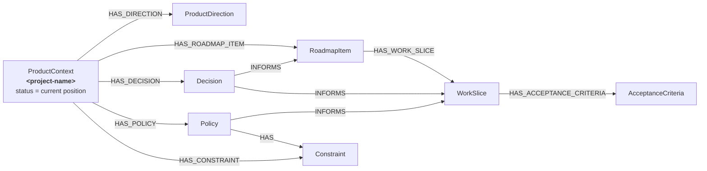
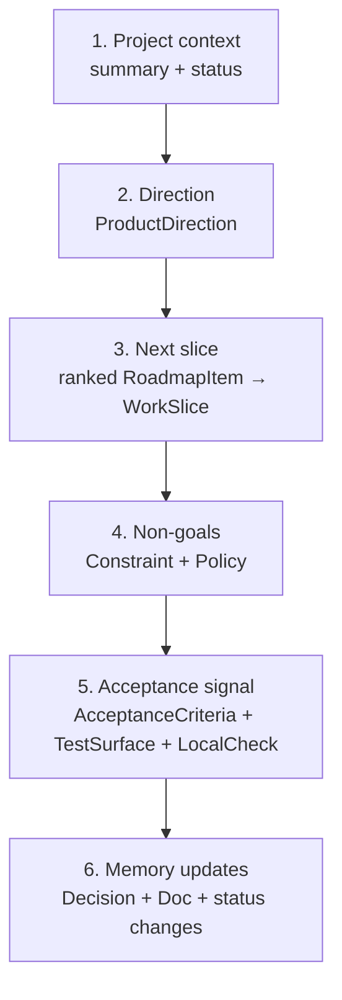
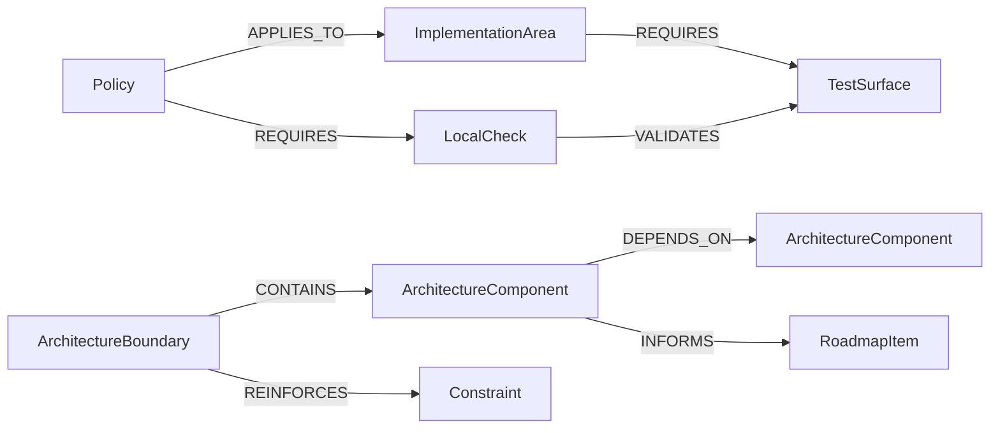
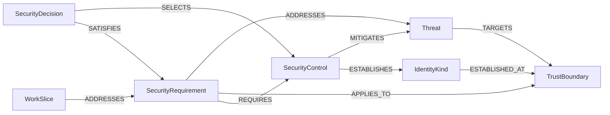

# SOML Project Memory Profile

Status: Candidate reusable profile  
Profile ID: `soml.profile.software-project-memory`  
Profile version: `0.1.0`  
Applicability: Any software product or project  
Origin: Developed through practical project-memory work on GRM and RAPTOR  
Schema source: `tmp/project-memory-schema.json`

## Purpose

The Project Memory profile is a reusable SOML schema for durable, agent-readable
software product memory. Its primary root is the `ProductContext` named
for the software project—for example, `Example Project`. That node is the
top-level indicator of overall product status
and the first record an agent or human should read. It connects product direction and roadmap planning to
architecture, engineering constraints, policies, implementation areas, tests,
local checks, decisions, risks, and security reasoning.

This is a **schema**, not a data export. It defines the permitted node and
relationship shapes. A workspace using the profile supplies its own product
contexts and project-specific facts.

The schema was originally developed and refined while managing GRM and RAPTOR.
That history is its provenance, not its application boundary: none of the
models, root conventions, or workflows require either project.

The profile is a candidate named SOML schema profile. That label is descriptive
rather than a standards claim: the profile has not been ratified as a universal
or final standard.

## Design principles

- `ProductContext` is both the isolation root and product-status header. For
  each software project, use one root context whose `name` is the project's
  stable name. Its `status` and `summary` answer “where are we now?” before a
  reader traverses supporting detail.
- A context's `status` is an editorial product judgement maintained from
  evidence below it. It is not mechanically derived from child status values.
- Project-specific product memory should be reached through its context rather
  than connected by thematic similarity.
- Titles and names are semantic lookup keys. Runtime integer IDs are internal
  identities and should not be used as portable external references.
- `status` values are intentionally strings so a product can adopt a controlled
  lifecycle vocabulary without changing the structural profile.
- Relationship `reason` fields capture concise provenance: why a connection is
  asserted, not a duplicate description of either endpoint.
- Policies describe repeatable operating rules; constraints describe boundaries;
  decisions record accepted choices and rationale.
- Test surfaces and local checks make verification part of project memory rather
  than an implicit convention.
- Security models keep threats, requirements, controls, trust boundaries,
  identity, questions, and decisions distinct.

## Conceptual map



## Product-manager orientation

The project's root `ProductContext` is the front door to status. Read the graph
in this product-management order:



The context status is deliberately a concise roll-up, while its summary should
state the current position in plain language. Supporting nodes provide the
evidence and detail:

| PM question | Read from |
|---|---|
| Where is the product now? | Root `ProductContext` summary and status |
| Where is it going? | outgoing `HAS_DIRECTION` |
| What is next? | ranked active `HAS_ROADMAP_ITEM`, then `HAS_WORK_SLICE` |
| What bounds the move? | `HAS_CONSTRAINT`, `HAS_POLICY`, and linked decisions |
| How will we know it worked? | acceptance criteria, test surfaces, and local checks |
| What changed the map? | decisions and documents, followed by explicit status updates |

Child states do not automatically override the product status. A completed work
slice may leave the overall context `active`; a blocked critical slice may cause
the product context to become `blocked` only after an explicit PM judgement.
This avoids misleading roll-ups and keeps status accountable and explainable.





## Intended workflow

1. Find or create the root `ProductContext` using the software project's stable
   name; read it first on every orientation pass and maintain its summary and
   status explicitly.
2. Create separate contexts for other isolated products or contribution scopes.
3. Attach direction, roadmap items, policies, constraints, and decisions to the
   correct context.
4. Decompose roadmap items into work slices with acceptance criteria, risks,
   open questions, and effort estimates.
5. Connect policies to implementation areas, checks, and test surfaces.
6. Record architecture and security evidence through their dedicated subgraphs.
7. Query outward from the selected `ProductContext`; do not join unrelated
   contexts merely because they use the same technology or concern.
8. Treat graph claims as project memory. Verify implementation claims against
   current code, tests, and executable checks.
9. After a decision, merged slice, or important discovery, update affected child
   nodes and then reconsider the root context's summary and status. Do not claim
   completion until implementation and acceptance evidence support it.

## Executable SOML schema

The following commands can be run in a new SOML-compatible workspace. Types use
the current command spelling: `string` and `int`. Fields without `:required`
are optional.

```text
model.define AcceptanceCriteria acceptanceCriteriaId text:string:required status:string
model.define ArchitectureBoundary architectureBoundaryId name:string:required summary:string:required status:string
model.define ArchitectureComponent architectureComponentId name:string:required layer:string:required summary:string:required status:string
model.define Constraint constraintId title:string:required summary:string:required status:string
model.define Decision decisionId title:string:required summary:string:required status:string date:string rationale:string
model.define Doc docId path:string:required title:string:required summary:string:required status:string
model.define EffortEstimate effortEstimateId size:string:required uncertainty:string:required rationale:string
model.define IdentityKind identityKindId name:string:required summary:string:required proofSource:string status:string
model.define ImplementationArea implementationAreaId name:string:required summary:string:required status:string
model.define LocalCheck localCheckId name:string:required command:string:required purpose:string:required whenToRun:string notes:string status:string
model.define OpenQuestion openQuestionId question:string:required impact:string:required status:string
model.define Policy policyId title:string:required summary:string:required status:string rationale:string
model.define ProductContext productContextId name:string:required summary:string:required status:string
model.define ProductDirection productDirectionId title:string:required summary:string:required timeframe:string
model.define Risk riskId title:string:required summary:string:required severity:string status:string
model.define RoadmapItem roadmapItemId title:string:required summary:string:required status:string rank:int userValue:int architectureLeverage:int riskReduction:int readiness:int rankingRationale:string
model.define SecurityControl securityControlId title:string:required summary:string:required controlType:string:required layer:string:required status:string
model.define SecurityDecision securityDecisionId title:string:required summary:string:required status:string date:string rationale:string
model.define SecurityOpenQuestion securityOpenQuestionId question:string:required impact:string:required decisionNeededBy:string status:string
model.define SecurityRequirement securityRequirementId title:string:required summary:string:required priority:string verification:string status:string
model.define TestSurface testSurfaceId name:string:required pathPattern:string summary:string:required status:string
model.define Threat threatId title:string:required summary:string:required category:string:required severity:string status:string
model.define TrustBoundary trustBoundaryId name:string:required summary:string:required trustAssumption:string deploymentScope:string status:string
model.define WorkSlice workSliceId title:string:required summary:string:required status:string rank:int userValue:int architectureLeverage:int riskReduction:int readiness:int rankingRationale:string

link.define ARCHITECTURE_DOCUMENTED_BY ArchitectureComponent Doc architectureDocumentedById reason:string
link.define BOUNDARY_DOCUMENTED_BY ArchitectureBoundary Doc boundaryDocumentedById reason:string
link.define BOUNDARY_INFORMS_ROADMAP_ITEM ArchitectureBoundary RoadmapItem boundaryInformsRoadmapItemId reason:string
link.define BOUNDARY_REINFORCES_CONSTRAINT ArchitectureBoundary Constraint boundaryReinforcesConstraintId reason:string
link.define COMPONENT_DEPENDS_ON ArchitectureComponent ArchitectureComponent componentDependsOnId reason:string
link.define COMPONENT_INFORMS_ROADMAP_ITEM ArchitectureComponent RoadmapItem componentInformsRoadmapItemId reason:string
link.define COMPONENT_IN_BOUNDARY ArchitectureComponent ArchitectureBoundary componentInBoundaryId reason:string
link.define CONTROL_APPLIES_TO_BOUNDARY SecurityControl TrustBoundary controlAppliesToBoundaryId reason:string
link.define CONTROL_ESTABLISHES_IDENTITY SecurityControl IdentityKind controlEstablishesIdentityId reason:string
link.define CONTROL_MITIGATES_THREAT SecurityControl Threat controlMitigatesThreatId reason:string
link.define DECISION_RESOLVES_SECURITY_QUESTION SecurityDecision SecurityOpenQuestion decisionResolvesSecurityQuestionId reason:string
link.define DECISION_SATISFIES_SECURITY_REQUIREMENT SecurityDecision SecurityRequirement decisionSatisfiesSecurityRequirementId reason:string
link.define DECISION_SELECTS_SECURITY_CONTROL SecurityDecision SecurityControl decisionSelectsSecurityControlId reason:string
link.define DOCUMENTED_BY Decision Doc documentedById reason:string
link.define HAS_ACCEPTANCE_CRITERIA WorkSlice AcceptanceCriteria hasAcceptanceCriteriaId reason:string
link.define HAS_CONSTRAINT ProductContext Constraint hasConstraintId reason:string
link.define HAS_DECISION ProductContext Decision hasDecisionId reason:string
link.define HAS_DIRECTION ProductContext ProductDirection hasDirectionId reason:string
link.define HAS_EFFORT_ESTIMATE WorkSlice EffortEstimate hasEffortEstimateId reason:string
link.define HAS_POLICY ProductContext Policy hasPolicyId reason:string
link.define HAS_ROADMAP_ITEM ProductContext RoadmapItem hasRoadmapItemId reason:string
link.define HAS_WORK_SLICE RoadmapItem WorkSlice hasWorkSliceId reason:string
link.define IDENTITY_ESTABLISHED_AT IdentityKind TrustBoundary identityEstablishedAtId reason:string
link.define INFORMS_ROADMAP_ITEM Decision RoadmapItem informsRoadmapItemId reason:string
link.define INFORMS_WORK_SLICE Decision WorkSlice informsWorkSliceId reason:string
link.define ITEM_HAS_OPEN_QUESTION RoadmapItem OpenQuestion itemHasOpenQuestionId reason:string
link.define ITEM_HAS_RISK RoadmapItem Risk itemHasRiskId reason:string
link.define LOCAL_CHECK_VALIDATES_SURFACE LocalCheck TestSurface localCheckValidatesSurfaceId reason:string
link.define POLICY_APPLIES_TO Policy ImplementationArea policyAppliesToId reason:string
link.define POLICY_DOCUMENTED_BY Policy Doc policyDocumentedById reason:string
link.define POLICY_HAS_CONSTRAINT Policy Constraint policyHasConstraintId reason:string
link.define POLICY_INFORMS_WORK_SLICE Policy WorkSlice policyInformsWorkSliceId reason:string
link.define POLICY_REQUIRES_LOCAL_CHECK Policy LocalCheck policyRequiresLocalCheckId reason:string
link.define PRODUCT_CONTEXT_DOCUMENTED_BY ProductContext Doc productContextDocumentedById reason:string
link.define QUESTION_CONCERNS_REQUIREMENT SecurityOpenQuestion SecurityRequirement questionConcernsRequirementId reason:string
link.define REINFORCES_CONSTRAINT Decision Constraint reinforcesConstraintId reason:string
link.define REQUIREMENT_ADDRESSES_THREAT SecurityRequirement Threat requirementAddressesThreatId reason:string
link.define REQUIREMENT_APPLIES_TO_BOUNDARY SecurityRequirement TrustBoundary requirementAppliesToBoundaryId reason:string
link.define REQUIREMENT_REQUIRES_CONTROL SecurityRequirement SecurityControl requirementRequiresControlId reason:string
link.define REQUIRES_TEST_SURFACE ImplementationArea TestSurface requiresTestSurfaceId reason:string
link.define ROADMAP_DEPENDS_ON RoadmapItem RoadmapItem roadmapDependsOnId reason:string
link.define SECURITY_DECISION_DOCUMENTED_BY SecurityDecision Doc securityDecisionDocumentedById reason:string
link.define SLICE_ADDRESSES_SECURITY_REQUIREMENT WorkSlice SecurityRequirement sliceAddressesSecurityRequirementId reason:string
link.define SLICE_DEPENDS_ON WorkSlice WorkSlice sliceDependsOnId reason:string
link.define SLICE_HAS_OPEN_QUESTION WorkSlice OpenQuestion sliceHasOpenQuestionId reason:string
link.define SLICE_HAS_RISK WorkSlice Risk sliceHasRiskId reason:string
link.define SLICE_HAS_SECURITY_QUESTION WorkSlice SecurityOpenQuestion sliceHasSecurityQuestionId reason:string
link.define SLICE_TARGETS_SECURITY_CONTROL WorkSlice SecurityControl sliceTargetsSecurityControlId reason:string
link.define THREAT_TARGETS_BOUNDARY Threat TrustBoundary threatTargetsBoundaryId reason:string
```

## Domain guide

| Domain | Primary models | What it remembers |
|---|---|---|
| Context | `ProductContext`, `ProductDirection`, `Doc` | Scope, intent, orientation, and evidence |
| Delivery | `RoadmapItem`, `WorkSlice`, `AcceptanceCriteria`, `EffortEstimate` | Sequenced outcomes and readiness |
| Governance | `Policy`, `Constraint`, `Decision`, `OpenQuestion`, `Risk` | Rules, boundaries, choices, uncertainty |
| Engineering | `ImplementationArea`, `TestSurface`, `LocalCheck` | Ownership and executable verification |
| Architecture | `ArchitectureBoundary`, `ArchitectureComponent` | System shape, dependencies, and leverage |
| Security | `TrustBoundary`, `Threat`, `SecurityRequirement`, `SecurityControl`, `IdentityKind`, `SecurityDecision`, `SecurityOpenQuestion` | Threat-to-control reasoning and accepted security direction |

## Portability and evolution

The companion JSON file, `project-memory-schema.json`, contains the same schema
as structured profile metadata and exact executable definitions. Consumers
should reject unknown required fields, tolerate additive optional metadata, and
compare `profileVersion` before applying future migrations.

This profile intentionally does not standardize backend storage, physical IDs,
authentication, authorization, multi-writer coordination, or a textual query
language. Those are separate runtime and protocol concerns.
